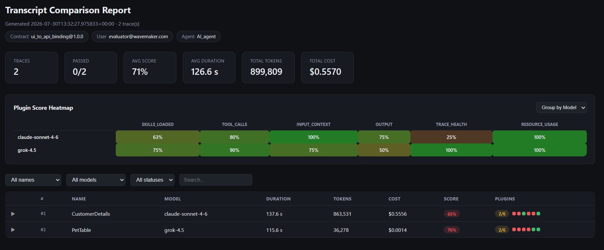

{/* truncate */}

<PillGroup>
  <Pill type="evaluation-framework" text="Evaluation Framework" />

  <Pill type="Transcript " text="AI Agents" />

  <Pill type="agents" text="Transcript" />

  <Pill type="agents" text="Data Context" />

  <Pill type="agentic-servers" text="Skills, MCP Tools" />
</PillGroup>

---

## AI Agent Workflows

Modern AI agents load **Skills** for reasoning, **MCP Tools** for execution, and input **Context** to complete a task and produce the expected outcome. Building these agent workflows may seem straightforward, but the real challenge lies in measuring their consistency and reliability. Can an agent consistently follow the expected workflow and achieve the desired outcome across different LLMs?

---

## Evaluating the Transcript

As AI agents become more autonomous, evaluating the **Transcript** of an agent execution becomes just as important as verifying the outcome. Beyond checking whether the task succeeded, it is essential to determine whether the correct Skills were loaded, the appropriate MCP Tools were invoked, the required Context was consumed, and the expected artifacts were generated throughout the execution.

### Sample Use Case: Binding UI with an API endpoint

An API Binding Agent may use Skills for intent understanding, project context analysis, and API schema analysis while invoking MCP Tools to create service variables, apply UI bindings, and update the project. Throughout the task, the agent consumes project Context — including project metadata, widgets, variables, and API definitions — and produces artifacts such as service variable and binding configuration files.

A complete Transcript captures every reasoning step, tool invocation, and intermediate action, while the outcome reflects the resulting project state.

---

### Sample Transcript

```json
{
  "trace_id": "traceID12345",
  "status": "success",
  "duration_ms": 115575,
  "model": "grok-4.5",
  "entry_agent": "AI_agent",
  "user_prompt": "Bind CustomerDetailsTable Component in ContomerDetailsPage to get /weavers/v1/CustomerDetails endpoint using CustomerDetailsService",
  "final_response": "Task 2b: API metadata verified for customerdetails / CustomerDetails. Task 3: Binding of swagger_CustomerDetailsTable on CustomerDetails complete.",

  "skills_loaded": [
    { "agent": "AI_agent",          "skills": ["ui_to_api_binding_workflow"],                                        "at": "12:20:05" },
    { "agent": "backend_expert", "skills": ["explore-codebase", "web-service"],                        "at": "12:20:16" },
    { "agent": "backend_expert", "skills": ["explore-api"],                                                      "at": "12:20:18" },
    { "agent": "ui_expert",      "skills": ["variables", "binding", "markup", "page_management", "component_metadata"], "at": "12:20:52" },
    { "agent": "ui_expert",      "skills": ["javascript"],                                                       "at": "12:21:19" }
  ],

  "tool_calls": [
    { "tool": "load_skill",                        "agent": "AI_agent",          "at": "12:20:05", "input": "ui_to_api_binding_workflow" },
    { "tool": "start_new_conversation_with_agent", "agent": "AI_agent",          "at": "12:20:14", "input": "→ backend_expert: verify weavr API metadata" }
  ],

  "file_changes": [
    { "operation": "UPDATE", "file": "src/main/webapp/pages/CustomerDetails/CustomerDetails.js", "tool": "edit_file_content", "at": "12:21:39" }
  ],

  "errors": []
}
```

## The Evaluation Framework

To help AI agent developers evaluate their agents running on any agent harness consistently across different LLMs, using identical tasks and inputs, we built a **Contract-Driven Evaluation Framework**.

---

### Sample Contract

```yaml
workflow: ui_to_api_binding
contract_version: "1.0.0"
name: CustomerDetails
skills:
  required:
    - [ui_to_api_binding_workflow, explore-codebase, explore-api, variables, codegen, javascript]
  optional:
    - []
tools:
  required:
    - [find_files, get_tool_schema, write_file, ui_updateVariable, listPageVariables, execute_tool]
  optional:
    - [edit_file]
  forbidden:
    - [delete_file]
knowledge:
  - /catalog/components/wm-table/wm-table.md
resources:
  api:
    - name: CustomerDetails
      path: services/weavr/customers/CustomerDetails.json
  page:
    - name: CustomerDetailsPage
      path: src/main/webapp/BBApp/pages/Customers/CustomerDetailsPage.html
input_context:
  - resource: page.CustomerDetails
output:
  - resource: page.CustomerDetailsPage.variable.CustomerDetailsVariable
    operation: CREATE
```

---

## Running Evaluation Framework

Running is simple. Clone the [evaluation framework repo](https://github.com/OmneWave/eval-framework-aiagents), define a **Contract** that specifies the expected agent behavior and **Success Criteria** for a task. provide the resulting Langfuse Transcript (Trace) to the Evaluation Framework.

The framework runs a set of deterministic **Graders**, each containing **Assertions** that validate different aspects of the Transcript and the outcome. The Evaluation Framework then aggregates these results into measurable scores, giving developers clear insights into the agent's **Capability**, **Consistency**, and **Reliability** across different models and repeated Trials.

### Evaluation Report: Sonnet vs. Grok


*Sample evaluation report comparing claude-sonnet-4-6 and grok-4.5 on the same Contract.*

---

Skills loaded, Tools invoked, Context consumed, outcome measured — one Contract, run against any model, any number of times.
