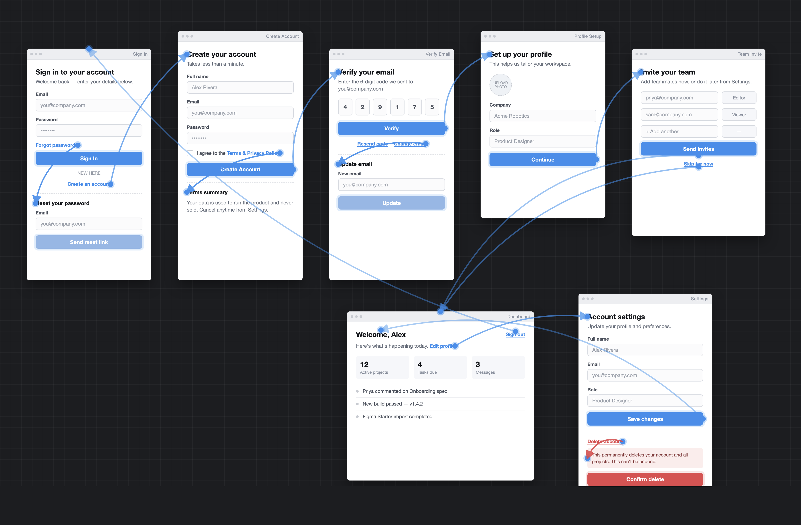

<PillGroup>
  <Pill type="sdd" />

  <Pill type="design-system" />

  <Pill type="figma" />
</PillGroup>

---

**Spec Driven Development flips the usual vibe coding approach.** Instead of prompting your way straight to code, you get the spec right first — user stories, plan, tasks — and then let the LLM implement against it.

---

## Spec Driven Development: the current scenario

[SpecKit](https://github.com/github/spec-kit) is the open source tool built around this workflow. It provides a set of commands that give developers a way to build apps, sort of like how git commands are used to perform a PR workflow. The commands run in order to complete the workflow:

```text
constitution → specify → plan → tasks → implement
```

In this realm, getting output fast is not the primary target — getting it right with a minimum number of iterations is.

In enterprises, getting the UI output as a designer envisioned it is still a daunting task, and it is left on the developer's shoulders. You simply cannot prompt your way out and get the best finished output with maximum fidelity. Getting the layouts, design tokens, and interactions right is still done manually, even with an SDD approach.

### Building multiple screens from Figma: what a developer has to take care of

For a single screen, prompting can get you most of the way there. A real module is rarely one screen though — it's a flow of screens, and each one adds work that doesn't show up until you're doing it by hand:

- **Components and variants** — which components repeat across screens, and what variants and states they need (hover, disabled, error), so you're not rebuilding the same button five different ways.
- **Design tokens** — colors, spacing, and typography pulled once and applied consistently, not eyeballed per screen.
- **Icons and images** — every icon and embedded image exported and wired in, screen by screen.
- **Screen-to-screen flow** — which tap or action goes where. Get this wrong and the "working" screens don't add up to a working flow.
- **Build order** — what to build first, so later screens aren't blocked on ones you haven't gotten to yet.

Multiply this across every screen in the section, and "just prompt it" stops working. Unless you're supergood at prompting and have the time to spell all of this out yourself — for every screen — you end up doing multiple passes to fix the gaps. Which is exactly the extra iteration SDD is supposed to save you from.


*Simple module flow in Figma*

{/* truncate */}

---

## Introducing the SpecKit extension figma-starter

We have published a new extension to SpecKit, [figma-starter](https://omnewave.github.io/spec-kit-figma-starter/). Just like SpecKit, this extension is framework and tech stack agnostic, which means any developer can use it in their dev cycle.

---

## Why this extension

The extension is a great starting point when it comes to implementing a new module in a greenfield or brownfield app. It fetches all the metadata a developer would need before starting UI development.

---

## What the extension does

The extension takes a Figma design section's URL as input, analyses the screens in the provided design section, establishes the correlation between the screens, and churns out user stories and page-level specs, ordered in a task order file. It also collects all the design system information such as design tokens, along with resources such as the icons and images used.

```text
pull-screens → trace-flows → read-screens → write-spec
```

- **pull-screens** — section frames to PNGs, plus prototype taps, into `screens.json`
- **trace-flows** — builds the flow map (pages, dialogs, journeys)
- **read-screens** — layout notes per page, dialog, and step
- **write-spec** — `user-stories.md`, `build-order.md`, and one `spec.md` per screen

---

## Workflow

The extension adds a step to the existing SpecKit flow. The developer runs the `figma-starter.import` command and gets all the metadata and specs required to initiate spec driven development. This metadata then acts as the input to the existing SpecKit tasks.

So instead of just prompting:

> **"Build a Registration flow with a login page and a registration page"**

and then manually reviewing and running clarify tasks, the developer prompts:

> **"Here is the spec for the Registration flow along with all screens involved, plus the design tokens and required resources."**

With this rich set of input, the LLM generates much more fine-tuned specs and tasks that need fewer iterations from the developer.

```text
/speckit.constitution
        ↓
/speckit.figma-starter.import   (this extension)
        ↓
/speckit.specify
        ↓
/speckit.plan → /speckit.tasks → /speckit.implement
```

---

## What next?

- Add a **sync** command to the extension, which handles further modifications and additions in the Figma design and updates the existing specs and tasks.
- Add more input sources other than Figma — for example Claude design or screenshots.
- Add an **api-specgen** command to generate UI-to-API binding specs.

---

## Resources

- GitHub repo: [github.com/OmneWave/spec-kit-figma-starter](https://github.com/OmneWave/spec-kit-figma-starter)
- GitHub Pages: [omnewave.github.io/spec-kit-figma-starter](https://omnewave.github.io/spec-kit-figma-starter/)
