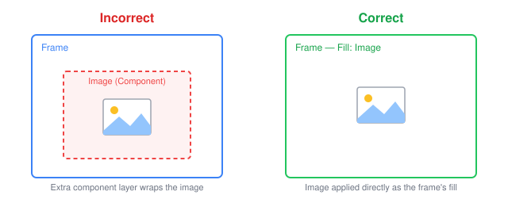
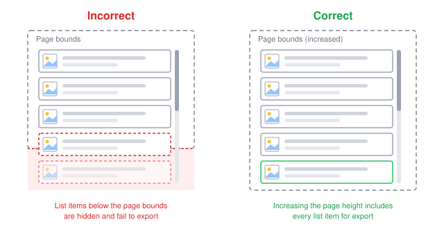
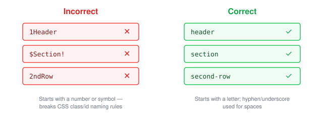
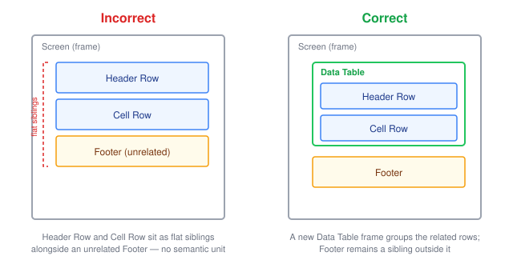

---

When designing in Figma for the WaveMaker Design to Code plugin, following these guidelines will help ensure that the generated code accurately reflects the design, reducing the number of manual adjustments needed in the development phase.

## Proper Use of Auto Layout

Auto Layout organizes elements into responsive hierarchies, ensuring better behavior during conversion. This is especially important in complex designs. To simplify this process, try Figma's [Suggest Auto Layout](https://help.figma.com/hc/en-us/articles/5731482952599-Add-auto-layout-to-a-design#suggest) feature. If Auto Layout isn't already applied, you can find it in the Figma toolbar shown below, or by searching the help menu for "Auto Layout."

Below are some suggestions on using auto layout:

- When a child element needs to match the width of its parent frame, set its width to "Fill." Fixed widths are treated as fixed sizes and will not adjust to different screen sizes. For any extra space around the element, use the padding feature in Figma.

- For elements whose height and width are dynamically calculated based on screen resolution (such as navigation bars or containers holding lists of cards), set the gap between child elements to **Auto** instead of a fixed value. A fixed gap will be treated as intentional spacing and maintained regardless of screen size when converting to code.

- The use of hug, fill, min and max width and height is highly encouraged as they will make your design and code outputs truly responsive.

## Avoid Unnecessary Children

Minimize nested frames or groups whenever possible. For example, instead of adding a rectangle inside a frame to hold a background image, apply the image directly to the frame's Fill property.

**Incorrect** — a separate rectangle inside the frame holds the background image:

**Correct** — the background image is applied directly to the frame's Fill property:

As a rule of thumb, if you're creating a unit solely to add a single property, try applying that property to the parent element instead.

## Images as Fills

Do not turn images into components. Unlike components, images aren't reused as repeatable units, so wrapping them as components misleads the plugin's understanding of what's actually repeatable and results in unnecessary frames being generated. Instead, use images as fills inside frames or rectangles.

## Charts

Design to Code does not support charts yet. Any chart in your design is converted to an image in the generated code.

Because of this, treat charts as images during annotation review. If a chart has not been annotated as **Image**, change it to Image yourself. A chart that comes through as a clean image is easier to replace with a real chart bound to real data using the WaveMaker AI Assistant once the project has been created.

## Color Management

WaveMaker Design to Code strictly follows the designer's intent, and this principle extends directly to how colors are handled in the generated code. If a designer defines a color as a local variable and applies it consistently across the design, particularly within components, that variable is preserved and translated into a corresponding CSS variable in the final code.

However, if a designer applies a color's hex code directly to a layer instead of referencing a variable, the generated code will reflect that hex code as a literal value rather than a variable. In this case, none of the benefits of using variables carry over to the output.

This has two practical implications. First, supporting multiple themes (such as light and dark mode) will only work correctly for colors that were defined and applied as variables; hardcoded hex values will not respond to theme changes. Second, if you later want to update your design's color palette, colors defined as variables can be updated in a couple of clicks from the styles workspace, while hardcoded hex values must be located and replaced manually, layer by layer.

## Figma API Issue with Hidden Elements

If a vector, image, or logo exceeds the defined page bounds, Figma may fail to export the "hidden" element as a picture. To resolve this, increase the page height in Figma to include the element. You do not need to fix the height of the screen to show scrollability — the prototype feature of Figma works well in such a scenario.

## Frame Naming

Naming frames clearly and descriptively helps both users and the AI/LLM recognize components and sections more accurately, which leads to better code output. Avoid naming frames with numbers or special characters at the beginning, since these names are used for CSS classes and ids, and CSS naming rules must be followed. Start frame names with letters, and use a hyphen `-` or underscore `_` for spaces. [Learn more about CSS naming conventions](https://medium.com/free-code-camp/css-naming-conventions-that-will-save-you-hours-of-debugging-35cea737d849).

## Semantic Grouping

When a section contains repeatable or related elements, group them under a meaningfully named parent frame rather than leaving them as loose siblings. For example, if you have a data table header row and one or more data table cell rows, wrap them together in a parent frame named something like "Data Table." This gives the AI/LLM a clear semantic unit to recognize instead of a flat list of unrelated rows.

This isn't strictly necessary, and the plugin can often still generate usable code without it. But semantic grouping goes a long way toward improving code quality, since it helps the plugin correctly infer the relationship between elements and generate more accurate, better-structured components. It's a small extra step in the design phase that can save significant time during development.

## Optional Features

The plugin settings include two features that start off switched off: **Wizards** and **Data Table**. While they are off, a wizard comes through as plain frames and a data table comes through as a list. Switch them on and the plugin builds the real WaveMaker widget instead.

They start off because wizards and tables are among the trickier things to design for. Every designer builds them a little differently, and WaveMaker has its own expectations about how the pieces fit together — which layer is a step, which row is the header, which cell sits where. Whether the generated widget turns out well comes down to those annotations being right, and you are in a far better position to judge that than the plugin is. So for now this one is left to you.

Turn them on if you already know how WaveMaker structures these widgets and you go through every annotation, not just the ones marked **Needs review**. If you would rather stick to the flagged ones, leave them off for now — you lose nothing, and you can always come back to this later. The [Data table](./annotation-glossary#data-table-web) entry in the annotation glossary is a good place to see what the plugin expects.
