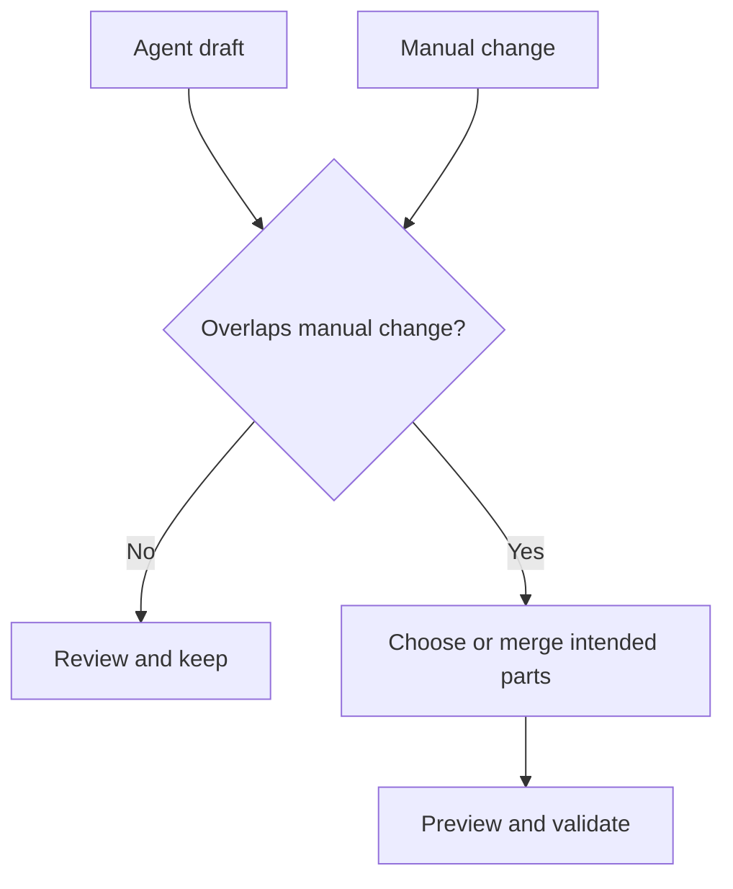

Agent sessions keep draft changes separate and record checkpoints as work progresses. Use that history to stop an incorrect run, restore a known state, or resolve overlap with manual work.

## Stop early when the scope is wrong

Stop a running task when:

- The agent is changing the wrong application area.
- The request omitted a critical boundary.
- An external dependency or service is not ready.
- Continuing would make the draft harder to review.

After stopping, inspect what changed. Restore a checkpoint when the partial result should not remain, or send a narrower correction when the useful work can be preserved.

## Restore a checkpoint

Choose the last checkpoint that represents a useful draft state. Restoring removes later work from the active session path.

Write the next request from that restored state:

```text
Keep the page layout from this checkpoint.
Bind the table to the existing Orders variable.
Do not create another service variable.
```

## Resolve overlapping changes

A conflict can occur when manual and agent work change the same artifact before the agent draft is kept.



Identify the exact page, file, property, or configuration that overlaps. Preserve one version or describe the intended merge. If the correct result is unclear, restore and repeat the smallest change rather than combining two uncertain drafts.

## Recover an interrupted session

Reopen the chat from history. Depending on the run state and Studio version, the session may offer resume, restore, edit, or regenerate controls. Inspect the last recorded checkpoint before continuing.

If the session state cannot be recovered, start a new chat and restate the current goal and boundaries. Do not rely on an interrupted draft that cannot be reviewed.
