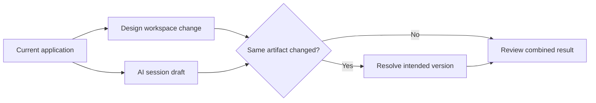

WaveMaker Studio lets developers move between the Design and AI workspaces in the same application. Use the Design workspace for direct visual edits and the AI workspace for scoped, request-driven work.

## Choose the workspace by the work

Use the Design workspace when the change is easier to make and verify directly, such as adjusting one widget property or arranging a small layout.

Use the AI workspace when the task benefits from project inspection, repeated edits, coordinated artifacts, or a natural-language outcome. Examples include building a page from a screenshot, wiring several bindings, adding backend logic, or applying a project rule across files.

## Avoid competing edits

Before starting an agent task, save or finish manual work in the target area. While the agent runs, avoid making a second change to the same page, service, variable, or configuration.

Work in other independent parts of the application can continue, but it should not depend on the unfinished agent draft.

## Review at the shared boundary

When both workflows touch the same feature:

1. Inspect the agent change set.
2. Compare it with the current Design workspace state.
3. Decide which values, structure, and bindings should remain.
4. Give the agent an explicit correction or resolve the overlap manually.
5. Preview the final application state.

Do not ask the agent to guess which conflicting version is correct. State the intended result.
