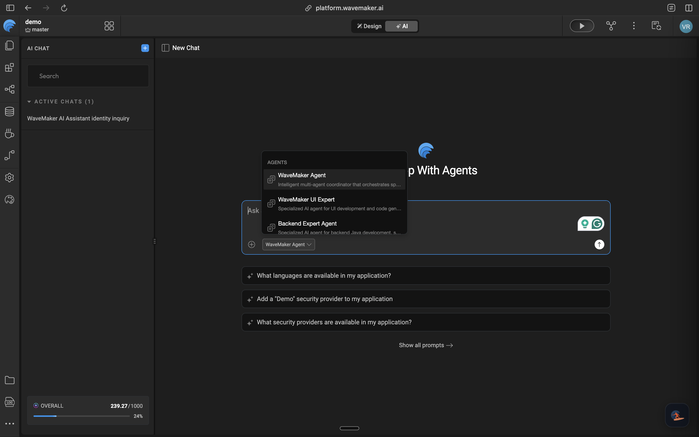

WaveMaker Studio lists the agents available for the current application. The list can change with the project platform, enabled features, and WaveMaker release.

## Select an agent

1. Open the application in WaveMaker Studio.
2. Select **AI** in the workspace switcher.
3. Start a new chat.
4. Open the agent selector at the lower-left of the prompt box.
5. Select the agent that matches the task.

Use **WaveMaker Agent** for work that crosses several development areas. Use a specialist when the request has one clear domain.

## Choose by task

| Task                                                                                                      | Recommended agent               |
| --------------------------------------------------------------------------------------------------------- | ------------------------------- |
| Coordinate a feature across UI, services, backend, or security                                            | WaveMaker Agent                 |
| Create or update pages, widgets, variables, actions, bindings, JavaScript, design tokens, or localization | WaveMaker UI Expert             |
| Work with Java services, databases, Query Services, web services, or server-side security                 | Backend Expert Agent            |
| Convert a Web screenshot into page markup and styling                                                     | Screenshot to Code              |
| Build a Native Mobile screen from a screenshot or Figma design, or add a supported device feature         | Mobile Screenshot to Code Agent |
| Review draft changes or a named scope against WaveMaker and project rules                                 | WaveMaker Code Review Agent     |

Some agents appear only for Web or Native Mobile projects. See [Supported agents](../reference/supported-agents) for current scope and boundaries.

## Use a specialist for a narrow change

A specialist starts with tools and skills suited to its domain. This makes the likely change surface easier to understand.

For example, use WaveMaker UI Expert to add a filter to an existing page. Use WaveMaker Agent when the same feature also needs a new backend calculation and an endpoint access rule.

## Keep one chat focused

A chat carries the context and checkpoints created during that session. Keep related revisions in the same chat. Start another chat when the goal changes substantially or the new task should have an independent change history.
