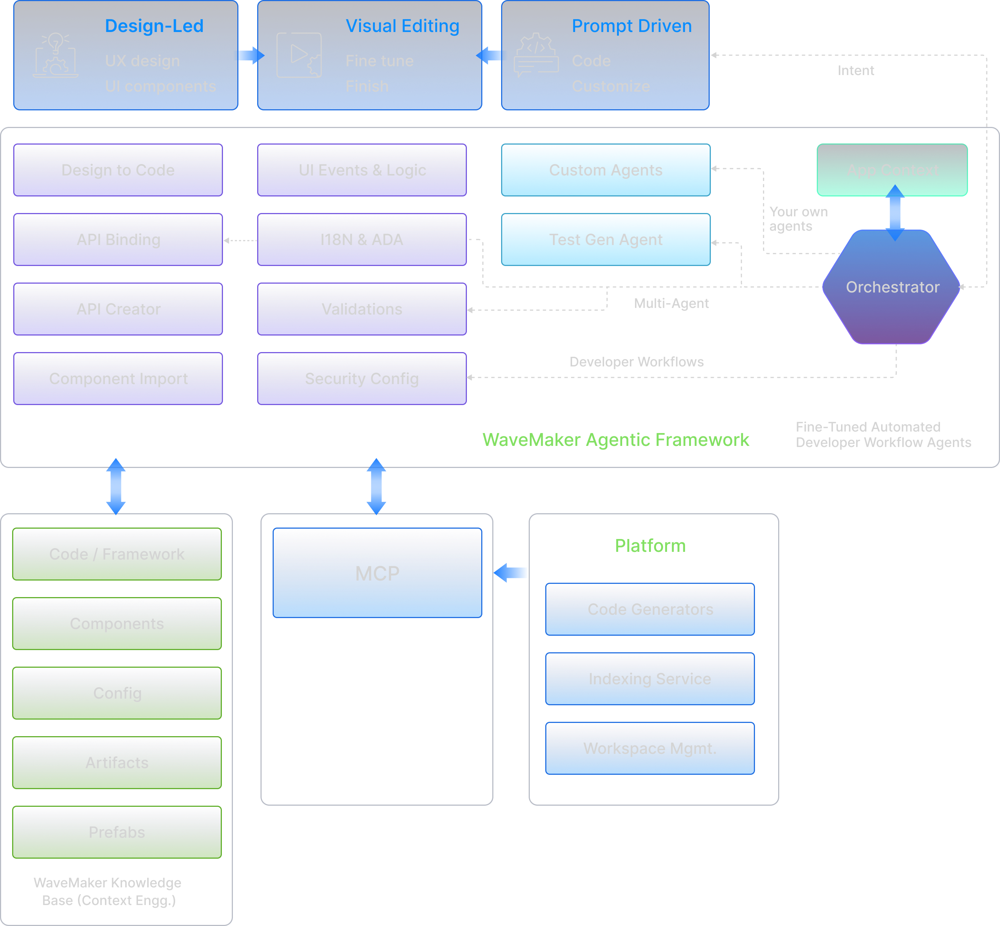

WaveMaker AI Assistant is the AI workspace in WaveMaker Studio. Describe the outcome you want, and the selected agent can inspect the application, use WaveMaker development tools, and prepare changes for you to review.



The assistant works with the application open in Studio. It can use the project's pages, services, variables, design system, and configuration, so a request starts from the application you already have rather than from a blank chat.

## What keeps agent work on track

WaveMaker agents combine three parts of the Studio experience:

| Part                 | What it does for the task                                                                                                   |
| -------------------- | --------------------------------------------------------------------------------------------------------------------------- |
| **Project context**  | Gives the agent the current application structure, existing artifacts, project instructions, and relevant draft state.      |
| **WaveMaker skills** | Supplies task-specific instructions for supported work, including the expected artifacts, platform conventions, and checks. |
| **Draft and review** | Keeps work reviewable while you inspect the result, request a correction, or restore a checkpoint.                          |

This is the practical difference between asking for code in a general chat and asking an agent to work in Studio: the request, the application, and the review all stay connected.

## The development loop

Agent-based development follows a short loop:

1. **Describe the outcome.** State what to build, where it belongs, and any boundaries the agent must respect.
2. **Choose an agent.** Select a general coordinator or a specialist for the task.
3. **Let the agent inspect and act.** The agent reads relevant project context, loads task-specific WaveMaker skills, and uses the tools assigned to it.
4. **Review the result.** Inspect the response and the proposed application changes.
5. **Refine or keep the change.** Continue the conversation, restore an earlier checkpoint, or apply the result to the application.

The agent manages the task. You decide what becomes part of the application.

## What agents can work on

The available agents and skills depend on the project type and the WaveMaker release. They can cover work such as:

| Area                | Example tasks                                                                                                                   |
| ------------------- | ------------------------------------------------------------------------------------------------------------------------------- |
| User interface      | Create or update pages and partials, configure widgets, add variables and actions, apply design tokens, and manage localization |
| APIs and data       | Import REST or OpenAPI services, inspect databases, manage Query Services, and bind UI elements to service data                 |
| Backend             | Create or update Java services, add business logic, and manage dependencies                                                     |
| Security            | Configure authentication providers, roles, endpoint access, CORS, CSRF, SSL, and related settings                               |
| Mobile              | Build screens from screenshots or Figma designs and add supported device features                                               |
| Extensions          | Find Marketplace artifacts and work with WaveMaker Extension components                                                         |
| Review and recovery | Review code, inspect changes, restore checkpoints, and recover from an unsuccessful change                                      |

## Agents, skills, and tools

These terms describe the parts of the Studio workflow:

- An **agent** receives the request and manages the task. Some agents coordinate work across several domains; others focus on UI, backend, screenshots, or code review.
- A **skill** is a set of WaveMaker-specific instructions for a kind of work. Skills describe the expected artifacts, conventions, checks, and sequence for that task.
- A **tool** reads or changes the application. Tools inspect files and metadata, update project artifacts, run checks, and return results to the agent.
- **Project context** gives the agent information about the current application, including its type, structure, existing artifacts, and project instructions.
- A **checkpoint** records a useful point in the session so that the work can be inspected or restored.

Read [How WaveMaker AI Assistant works](./understand-the-workflow/how-it-works) for a closer look at how these parts fit together.

## Start with one bounded task

The first prompt does not need to describe the whole application. Start with one page, service, or behavior and name the boundary around it.

For example:

```text
Create a Web page named TeamDirectory with a page title, a search field,
and employee cards backed by a static variable with three sample records.
Use the project's design tokens. Do not add service calls or backend code.
```

This request gives the agent an outcome, a small data source, a design constraint, and a clear limit. It does not require an external service or credentials. Follow [Complete your first task](../guide/ai-development/complete-your-first-task) for the full workflow.

## Find the right page

Use this section in the order that matches your goal:

- **Get started** explains what you need, how to choose an agent, and how to write a useful request.
- **Understand the workflow** explains project context, skills, tools, sessions, and checkpoints.
- **Build with agents** groups supported work by development area.
- **Control and collaborate** covers review, project instructions, visual development, recovery, and data handling.
- **Reference** lists agents, platform boundaries, terminology, and troubleshooting steps.
