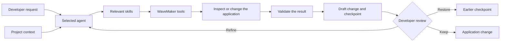

A request in the AI workspace enters a development loop around the current WaveMaker application. The selected agent receives the project context and task instructions it needs, uses its assigned tools, and returns a draft that you can inspect.

## The request sets the goal

The agent starts with the request and the application open in Studio. A useful request names the result, target area, and limits. It does not need to name internal files or tools.

## Project context grounds the work

Studio can supply the project type, existing artifacts, repository state, project instructions, and project-provided skills. The agent inspects the resources needed for the task instead of treating a request as an isolated prompt or placing every project file into every request.

## Skills provide WaveMaker task instructions

Skills are reusable playbooks for WaveMaker development. They capture the platform details a general coding assistant cannot infer: expected artifacts, platform rules, tool sequences, and validation for a kind of task.

The agent starts with a catalog and loads detailed skill instructions when they are relevant. Skills guide the work; they do not change the project by themselves.

## Tools inspect and change the application

Tools connect the agent to Studio and the project workspace. Depending on the agent, tools can inspect metadata and files, find application artifacts, create or update supported resources, check diagnostics, and compare draft states.

Each agent receives a bounded tool set. A specialist does not silently take on every type of work.

## Validation returns evidence

Tool results return to the agent as fresh context. The agent can inspect diagnostics, compare generated artifacts with the request, and correct errors before responding. The result still needs your project-specific review and testing.

For larger requests, WaveMaker Agent can coordinate specialists. It can show the planned tasks and report progress while each delegated task returns its result to the coordinator.

## Developer review closes the loop

Agent changes stay in a separate draft until you keep them. Review the affected artifacts, preview behavior, ask for a correction, or restore an earlier checkpoint. Review is part of the development loop, not a cleanup step after it.
