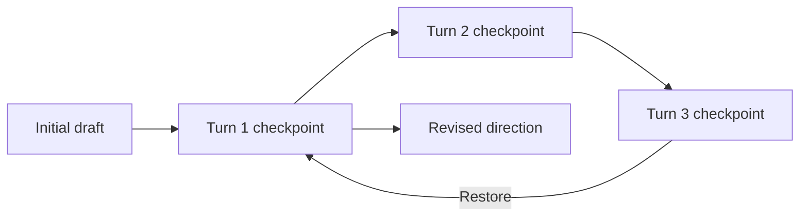

An AI chat is a working session for one development goal. It holds the conversation, agent activity, draft state, and checkpoints used to continue or restore the work.

## Continue related work in one session

Use the same chat when a follow-up changes or corrects the current result:

```text
Keep the page layout and service binding.
Add an empty state with a Retry action.
```

The agent can continue from the current draft and the context already gathered for the task.

Start a new chat when the goal changes, the target belongs to another independent feature, or the work needs a separate draft history. This makes review and recovery easier.

## Use chat history

The AI workspace lists active chats and provides search for finding a previous session. Reopening a session restores its recorded conversation and draft context. If a run was interrupted, the controls available in the environment determine whether it can resume or must be restored or regenerated.

The product environment controls retention and deletion policies. Check the organization's Studio configuration before relying on chat history as a permanent record.

## Understand checkpoints

The assistant records useful application states as the session progresses.



A checkpoint lets the draft return to an earlier state. Restoring a checkpoint removes later session work from the active path, so review the resulting change set before continuing.

## Keep session context manageable

Long conversations can contain outdated decisions. When the objective or constraints change substantially, start a new chat and state the current requirements directly. Do not make a new request depend on a correction buried far back in another session.

Suggested next actions and automatic conversation compaction may appear in supported environments. These features help continue a long session, but they do not replace a clear current request.
