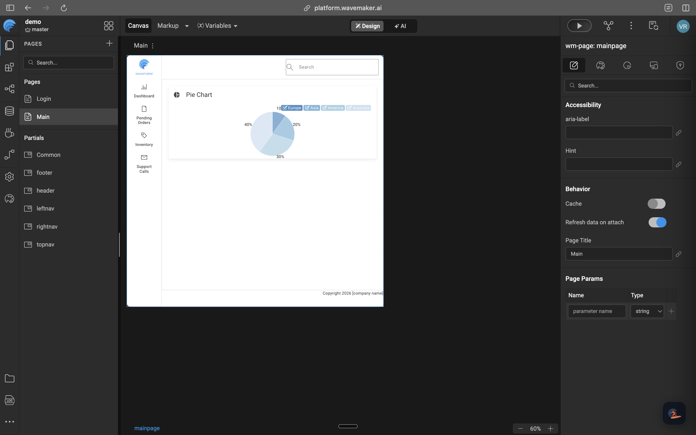

## Overview

Use WaveMaker UI Expert to create a small Web page, review the draft, and keep or restore the result. The page uses sample data stored in a static variable, so the task does not require a database, external service, or credentials.

## Prerequisites

Before you begin, make sure you have:

- A WaveMaker application open in Studio
- Access to the **AI** workspace
- A Web project where **WaveMaker UI Expert** appears in the agent selector
- A project state where unrelated manual changes are complete

## Open the AI workspace

1. Open the application in WaveMaker Studio.
2. Select **AI** in the workspace switcher.
3. Start a new chat.
4. Select **WaveMaker UI Expert**.



This task belongs entirely to the user-interface domain, so it does not require the general WaveMaker Agent to coordinate specialists.

## Send a bounded request

1. Paste this request into the chat:

   ```text
   Create a new Web page named TeamDirectory with:

   - the page title "Team Directory"
   - a search field above the content
   - employee cards showing name, role, and location
   - a static variable with three sample employee records

   Use the project's design tokens and auto-layout.
   Do not add service calls, backend code, navigation, or security changes.
   ```

2. Change the page name if `TeamDirectory` already exists.

3. Send the request.

The request names the outcome, data source, design constraint, and change boundary without depending on project-specific services.

## Check the proposed approach

1. Confirm that the agent plans to create one page named `TeamDirectory`.
2. Confirm that it plans to use a static variable for the three employee records.
3. Check the proposed widgets, variables, bindings, and design-token changes.
4. Verify that service, navigation, backend, and security artifacts remain outside the scope.
5. Correct the approach in the chat when needed:

   ```text
   Keep this as a standalone page.
   Do not add it to the application navigation yet.
   ```

The agent may ask for information when several artifacts have similar names.

## Let the agent complete the task

1. Keep the chat open while the task runs.
2. Follow the activity shown in the session.
3. Stop the run if it starts changing an unintended area.
4. Wait for the agent to finish and summarize the result.

The agent inspects the application, loads relevant skills, and uses WaveMaker tools to prepare a draft.

## Review the draft

1. Open `TeamDirectory` in Studio.
2. Confirm that all three sample employees appear.
3. Check the card layout, labels, and variable bindings.
4. Preview the page at more than one viewport width.
5. Verify that no service, backend, navigation, or security artifact changed.

If one part needs work, identify the accepted part and the required correction:

```text
Keep the employee cards and their bindings.
Change only the search field to use the project's compact input variant.
```

## Keep or restore the result

1. Continue in the same chat while refining this feature.
2. Use **Restore Checkpoint** if later changes move in the wrong direction.
3. Review the draft again after restoring.
4. Use the review control shown in Studio to keep the result when it is ready.

The exact labels for keeping or discarding a draft depend on the current Studio environment.

## Limitations and constraints

| Constraint         | Details                                                            |
| ------------------ | ------------------------------------------------------------------ |
| Project type       | This version of the tutorial requires a Web project.               |
| Agent availability | WaveMaker UI Expert must appear in the current project's selector. |
| UI labels          | Review controls can change between Studio releases.                |

## See also

- [Before you begin](../../developing-with-agents/get-started/before-you-begin)
- [Write effective requests](../../developing-with-agents/get-started/write-effective-requests)
- [Review and manage agent changes](../../developing-with-agents/control-and-collaborate/review-and-manage-changes)
