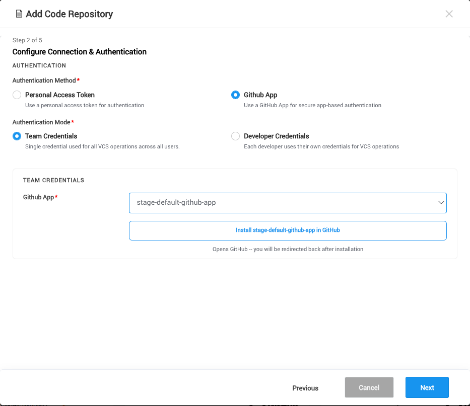
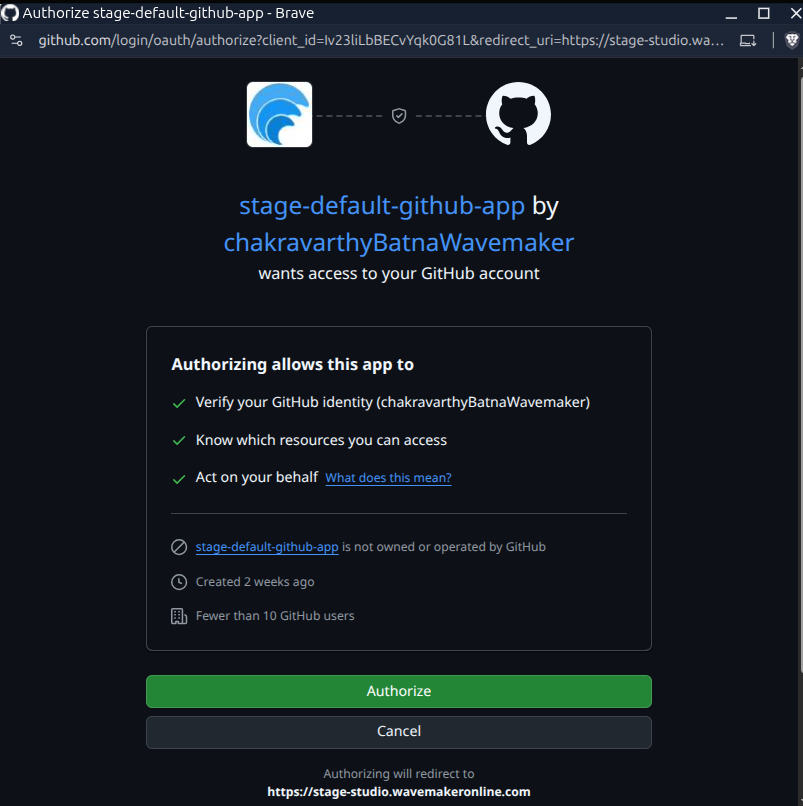
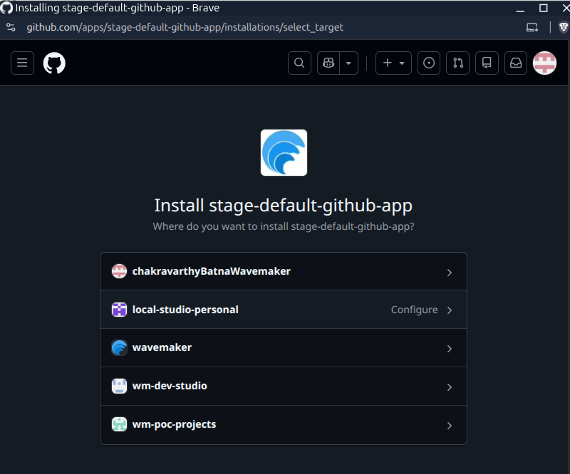
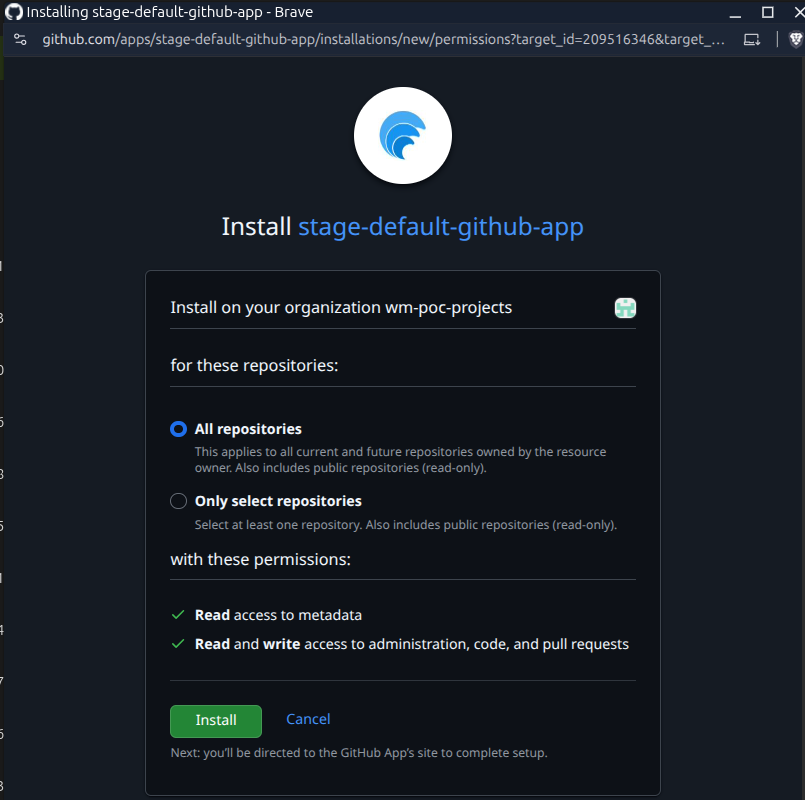
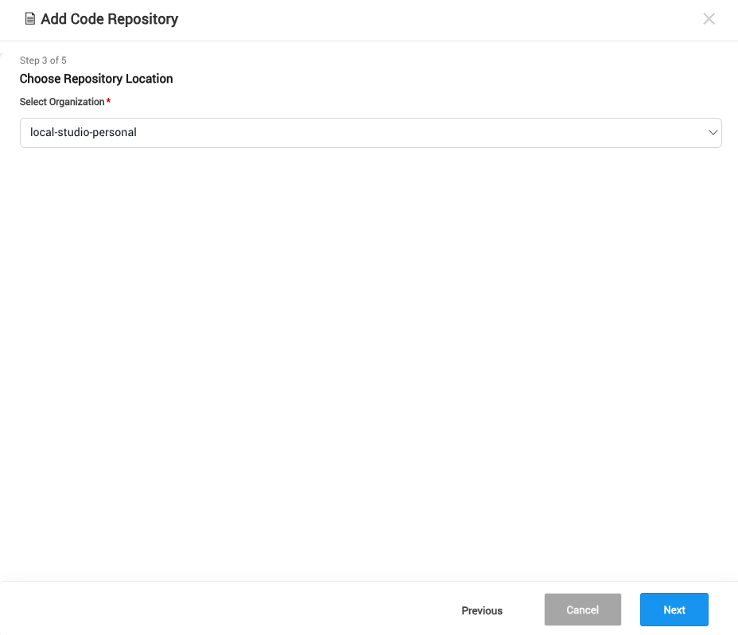
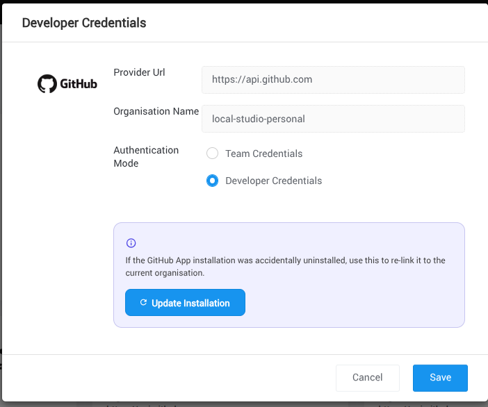

## Overview

The WaveMaker Platform lets you connect your projects to GitHub using **GitHub App-based authentication** — a credential-free alternative to a Personal Access Token (PAT). WaveMaker ships with a pre-configured, WaveMaker-managed GitHub App, so you only install and authorize it against your own GitHub account or organization. This guide explains what a GitHub App is and walks you through connecting one from the Team Portal.

---

## What is a GitHub App?

A **GitHub App** is an application registered on GitHub and installed into a user account or organization to act on GitHub repositories on its behalf. It is an independent identity on GitHub — separate from any individual user — and is granted scoped permissions on the specific repositories chosen at installation time.

GitHub Apps use short-lived installation tokens that GitHub issues and renews automatically. The WaveMaker Platform uses these tokens to perform repository operations such as cloning code, pushing commits, creating branches, and opening pull requests.

Earlier, connecting a Code Repository in the Team Portal using GitHub required a **Personal Access Token (PAT)** — you had to generate a long `ghp_...` token from GitHub's Developer Settings, supply it with your GitHub username, and regenerate it whenever it expired. The Team Portal now also supports a **GitHub App** as an authentication method, removing the need to manage tokens manually.

### Key benefits

- **Short-lived, auto-rotated credentials.** Installation tokens are issued and renewed by GitHub automatically — no manual generation or refresh.
- **Fine-grained repository access.** During installation, the owner can grant access to *all repositories* or only a *selected set*, so the integration sees only what it needs.
- **Granular permissions.** Each GitHub App declares the exact repository permissions it requires (for example, Contents, Pull requests, Administration), shown clearly during installation.
- **Independent of any individual user.** The app is installed on a user or organization account rather than tied to one user's credentials, so the integration keeps working even when team members change.
- **Built for organization-level workflows.** GitHub Apps fit naturally into team and enterprise setups where multiple repositories and members share the same integration.
- **Clear audit trail.** Actions performed via the GitHub App are attributed to the app itself, making platform actions easy to distinguish from user actions in repository history.
- **Simplified experience.** You connect repositories through a guided installation flow on GitHub — no tokens to generate, copy, or store.

---

## Prerequisites

Before you begin, make sure you have:

- Access to the **Team Portal** with permission to create a [Code Repository](../../studio/governance/code-repository-configuration.mdx).
- A GitHub account, or admin access to the GitHub organization where the app will be installed.

---

## Connect GitHub via a GitHub App

In the WaveMaker Platform, you connect to GitHub by creating a **Code Repository** (a VCS account) under **Team Portal → Code Repository**. While creating it, you choose an authentication method — **Personal Access Token (PAT)** or **GitHub App** — and can mark it as the **default**. From then on, every repository operation (create, push, pull, and other VCS actions) uses this Code Repository to talk to GitHub.

Because the platform ships with a WaveMaker-managed GitHub App, you do **not** need to create or register your own.

### Step 1 — Choose GitHub as the VCS provider

1. Navigate to **Team Portal → Code Repository → Add Code Repository**.
2. In the **Choose Provider** step, select **GitHub**.

### Step 2 — Configure authentication

1. Set **Authentication Method** to **GitHub App**.
2. Choose the required **Authentication Mode**:
   - **Team Credentials** — shared authorization used for team-wide repository operations.
   - **Developer Credentials** — repository operations are performed using each developer's own GitHub identity.
3. Select the **wmo-code-connect** GitHub App.
4. Click **Install GitHub App**.

### Step 3 — Authorize the GitHub App

You are redirected to GitHub's authorization page, which lists the permissions requested by the WaveMaker GitHub App. Click **Authorize** to continue.

### Step 4 — Install the GitHub App

After authorization, GitHub redirects you to the installation page. Here you can:

- Select the personal GitHub account or organization where the app should be installed.
- Choose whether the app can access **All repositories** or **Only selected repositories**.

:::note
If you choose **Only selected repositories**, the WaveMaker Platform can access **only those repositories** — it cannot see or operate on any other repository in your account or organization. To grant access to more repositories later, update the GitHub App installation settings on GitHub.
:::

Once installation is complete, the popup closes automatically and you return to the platform.

### Step 5 — Select the repository location

The platform automatically fetches available GitHub App installations. Select the GitHub **account** or **organization** you authorized and installed.

After selecting the installation, complete the remaining steps in the **Add Code Repository** wizard and **save** the Code Repository. The selected installation is used for repository creation and all subsequent VCS operations.

---

## Update a GitHub App installation

If the WaveMaker GitHub App is unintentionally **uninstalled** from the GitHub user or organization account configured in a Code Repository, the platform can no longer access those repositories. You can re-install the app and update the existing Code Repository without creating a new one.

1. Navigate to **Team Portal → Code Repository**.
2. Locate the Code Repository whose installation you want to update.
3. Click the **Credentials** button on that Code Repository.
4. Click **Update GitHub App Installation**.
5. When redirected to GitHub, re-install the WaveMaker GitHub App. Choose the same account/organization and repositories as before.
6. Once installation completes, the Code Repository reconnects automatically.

---

## See Also

- [Code Repository Configuration](../../studio/governance/code-repository-configuration.mdx)
- [Projects Collaboration](../../studio/governance/project-collaboration.mdx)
