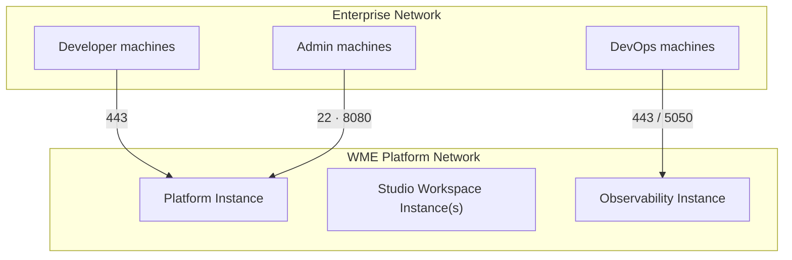

You can set up WaveMaker Enterprise AI on any machine.

:::note
This document uses words like **VM**, **Instance** to refer a machine.
:::

## **WME AI setup system requirements**

WaveMaker Enterprise AI can be installed on any machine that meets the following requirements. Before you start setting up WaveMaker Enterprise AI, review the minimum and recommended system requirements for each instance type.

### **WME AI Platform Instance**

<table style={{ fontSize: '0.875rem', fontFamily: 'inherit' }}>
  <colgroup>
    <col style={{ width: '120px' }} />

    <col />
  </colgroup>

  <thead>
    <tr>
      <th style={{ fontSize: '0.875rem' }}>Requirement</th>
      <th>Minimum configuration</th>
    </tr>
  </thead>

  <tbody>
    <tr>
      <td style={{ fontSize: '0.875rem' }}>Memory</td>
      <td><ul><li>Minimum 32 GB</li></ul></td>
    </tr>

    <tr>
      <td style={{ fontSize: '0.875rem' }}>CPU</td>
      <td><ul><li>8-core, single CPU system</li></ul></td>
    </tr>

    <tr>
      <td style={{ fontSize: '0.875rem' }}>Hard disk</td>
      <td><ul><li>Minimum 450 GB to be allocated</li><li>For volume-based setups, allocate:<ul><li>100 GB for <code style={{ fontFamily: 'inherit' }}>/</code></li><li>200 GB for <code style={{ fontFamily: 'inherit' }}>/wm-data</code></li><li>150 GB for <code style={{ fontFamily: 'inherit' }}>/wm-runtime</code></li></ul></li></ul></td>
    </tr>

    <tr>
      <td style={{ fontSize: '0.875rem' }}>Host OS</td>
      <td><ul><li>Ubuntu 22.x LTS or RHEL 8.x/9.x</li><li>Kernel 4.4 or later</li><li>x86 architecture</li></ul></td>
    </tr>

    <tr>
      <td style={{ fontSize: '0.875rem' }}>Software</td>
      <td><ul><li>Docker 28.x</li><li>Python 3.5 or later</li><li><code style={{ fontFamily: 'inherit' }}>wget</code></li><li><code style={{ fontFamily: 'inherit' }}>jq</code></li></ul></td>
    </tr>

    <tr>
      <td style={{ fontSize: '0.875rem' }}>Network</td>
      <td><ul><li>Static IP with valid DNS</li><li>See <a href="#external-access-ports">External Access Ports</a> for required ports.</li></ul></td>
    </tr>
  </tbody>
</table>

### **WME AI StudioWorkspace Instance and AppDeployment Instance**

<table style={{ fontSize: '0.875rem', fontFamily: 'inherit' }}>
  <colgroup>
    <col style={{ width: '120px' }} />

    <col />
  </colgroup>

  <thead>
    <tr>
      <th style={{ fontSize: '0.875rem' }}>Requirement</th>
      <th>Minimum configuration</th>
    </tr>
  </thead>

  <tbody>
    <tr>
      <td style={{ fontSize: '0.875rem' }}>Memory</td>
      <td><ul><li>Minimum 32 GB</li></ul></td>
    </tr>

    <tr>
      <td style={{ fontSize: '0.875rem' }}>CPU</td>
      <td><ul><li>8-core, single CPU system</li></ul></td>
    </tr>

    <tr>
      <td style={{ fontSize: '0.875rem' }}>Hard disk</td>
      <td><ul><li>Minimum 300 GB to be allocated</li><li>For volume-based setups, allocate:<ul><li>100 GB for <code style={{ fontFamily: 'inherit' }}>/</code></li><li>200 GB for <code style={{ fontFamily: 'inherit' }}>/data</code></li></ul></li></ul></td>
    </tr>

    <tr>
      <td style={{ fontSize: '0.875rem' }}>Host OS</td>
      <td><ul><li>Ubuntu 22.x LTS or RHEL 8.x/9.x</li><li>Kernel 4.4 or later</li><li>x86 architecture</li></ul></td>
    </tr>

    <tr>
      <td style={{ fontSize: '0.875rem' }}>Software</td>
      <td><ul><li>Docker 28.x</li><li>Python 3.5 or later</li><li><code style={{ fontFamily: 'inherit' }}>wget</code></li><li><code style={{ fontFamily: 'inherit' }}>jq</code></li></ul></td>
    </tr>

    <tr>
      <td style={{ fontSize: '0.875rem' }}>Network</td>
      <td><ul><li>Static IP</li><li>See <a href="#internal-communication-ports">Internal Communication Ports</a> for required ports.</li></ul></td>
    </tr>
  </tbody>
</table>

### **WME AI Observability Instance**

<table style={{ fontSize: '0.875rem', fontFamily: 'inherit' }}>
  <colgroup>
    <col style={{ width: '120px' }} />

    <col />
  </colgroup>

  <thead>
    <tr>
      <th style={{ fontSize: '0.875rem' }}>Requirement</th>
      <th>Minimum configuration</th>
    </tr>
  </thead>

  <tbody>
    <tr>
      <td style={{ fontSize: '0.875rem' }}>Memory</td>
      <td><ul><li>Minimum 16 GB</li></ul></td>
    </tr>

    <tr>
      <td style={{ fontSize: '0.875rem' }}>CPU</td>
      <td><ul><li>4-core, single CPU system</li></ul></td>
    </tr>

    <tr>
      <td style={{ fontSize: '0.875rem' }}>Hard disk</td>
      <td><ul><li>Minimum 200 GB to be allocated</li><li>For volume-based setups, allocate:<ul><li>200 GB for <code style={{ fontFamily: 'inherit' }}>/</code></li></ul></li></ul></td>
    </tr>

    <tr>
      <td style={{ fontSize: '0.875rem' }}>Host OS</td>
      <td><ul><li>Ubuntu 22.x LTS or RHEL 8.x/9.x</li><li>Kernel 4.4 or later</li><li>x86 architecture</li></ul></td>
    </tr>

    <tr>
      <td style={{ fontSize: '0.875rem' }}>Software</td>
      <td><ul><li>Docker 28.x</li><li>Docker Compose 28.x</li><li>Python 3.5 or later</li><li><code style={{ fontFamily: 'inherit' }}>wget</code></li><li><code style={{ fontFamily: 'inherit' }}>jq</code></li></ul></td>
    </tr>

    <tr>
      <td style={{ fontSize: '0.875rem' }}>Network</td>
      <td><ul><li>Static IP. DNS is optional — see <a href="#dns-mapping">DNS Mapping</a>.</li><li>See <a href="#external-access-ports">External Access Ports</a> for required ports.</li></ul></td>
    </tr>
  </tbody>
</table>

## **IP Addressing and DNS Mapping**

You will be needing IP Addresses for the following.

### **IP Address**

- One static IP for accessing the platform machine from your developer's network.
- Machine Static IP: This is the IP assigned to the machine during setup and should be accessible on your network, or
  - In the case of VM, it will be the local IP address, which should be rout table from in your LAN.
  - In case of AWS instance: Private static IP for the instance within your VPC (assigned via eth0 or via ENI on eth1,ens5)

### **DNS Mapping**

A DNS domain is **mandatory** for the Platform instance — developers access WaveMaker Studio using a domain name, not an IP address. DNS for other instances is optional but recommended.

| **Domain**                 | **Domain URL**                                                                           | **Required** | **Description**                                                                         |
| -------------------------- | ---------------------------------------------------------------------------------------- | ------------ | --------------------------------------------------------------------------------------- |
| WaveMaker Studio           | `wavemakerai.[mycompany].com`                                                            | Mandatory    | Used to access WaveMaker AI Studio                                                      |
| WaveMaker Deployed Apps    | `wmai-apps.[mycompany].com`   `wmai-stage.[mycompany].com`   `wmai-live.[mycompany].com` | Optional     | Used to access WaveMaker AI Studio apps deployed onto WaveMaker AI Cloud                |
| WaveMaker AI Observability | `wmai-analytics.[mycompany].com`                                                         | Optional     | Used to access WaveMaker AI Analytics service. If not configured, use port 5050 via IP. |

:::note
In the preceding table, `[mycompany]` is used as an example. Replace `[mycompany]` with your actual domain name.
:::

### **Docker Container Access**

- An IP range to be assigned to the Docker containers internally. The Minimum [CIDR](https://en.wikipedia.org/wiki/Classless_Inter-Domain_Routing#CIDR_notation) (Classless Inter-Domain Routing) range for Docker container network is 24.

You will be needing to assign a /24 CIDR to Docker during setup. This IP range should not be in use anywhere on your network and can be completely different from your network's range. These IPs are assigned internally by Docker to containers and these IPs won't be exposed on your network.

For example, if your network is using a 10.x.x.x\_range and the range\_192.168.x.x is not used anywhere in your network, you may assign this 192.168.x.x range to Docker. See [here](https://en.wikipedia.org/wiki/Private_network#Private_IPv4_address_spaces) for the possible LAN IP ranges.

## **Port Requirements**

### **External Access Ports**

These ports must be accessible from outside the WME platform network — from developer machines, DevOps teams, and admin machines.

:::note
Ports 443 on the Platform, AppDeployment, and Observability instances are accessed through a DNS name or load balancer, not directly via IP:port. Ensure the DNS entries (see [DNS Mapping](#dns-mapping)) resolve to the respective instances and that traffic on port 443 can reach them through your network or load balancer.
:::

<table style={{ fontSize: '0.875rem', fontFamily: 'inherit' }}>
  <colgroup>
    <col style={{ width: '70px' }} />

    <col style={{ width: '140px' }} />

    <col style={{ width: '260px' }} />

    <col style={{ width: '150px' }} />

    <col />
  </colgroup>

  <thead>
    <tr>
      <th style={{ fontSize: '0.875rem' }}>Port</th>
      <th style={{ fontSize: '0.875rem' }}>Instance</th>
      <th style={{ fontSize: '0.875rem' }}>DNS Name</th>
      <th style={{ fontSize: '0.875rem' }}>Accessed By</th>
      <th style={{ fontSize: '0.875rem' }}>Purpose</th>
    </tr>
  </thead>

  <tbody>
    <tr>
      <td style={{ fontSize: '0.875rem' }}>443</td>
      <td style={{ fontSize: '0.875rem' }}>Platform</td>
      <td style={{ fontSize: '0.875rem' }}><code style={{ fontFamily: 'inherit' }}>wavemakerai.\[mycompany].com</code></td>
      <td style={{ fontSize: '0.875rem' }}>Developer machines</td>
      <td style={{ fontSize: '0.875rem' }}>HTTPS access to WaveMaker Studio</td>
    </tr>

    <tr>
      <td style={{ fontSize: '0.875rem' }}>443</td>
      <td style={{ fontSize: '0.875rem' }}>AppDeployment</td>
      <td style={{ fontSize: '0.875rem' }}><code style={{ fontFamily: 'inherit' }}>wmai-apps.\[mycompany].com</code> <code style={{ fontFamily: 'inherit' }}>wmai-stage.\[mycompany].com</code> <code style={{ fontFamily: 'inherit' }}>wmai-live.\[mycompany].com</code></td>
      <td style={{ fontSize: '0.875rem' }}>Developers / end users</td>
      <td style={{ fontSize: '0.875rem' }}>Access to deployed WaveMaker applications</td>
    </tr>

    <tr>
      <td style={{ fontSize: '0.875rem' }}>443</td>
      <td style={{ fontSize: '0.875rem' }}>Observability</td>
      <td style={{ fontSize: '0.875rem' }}><code style={{ fontFamily: 'inherit' }}>wmai-analytics.\[mycompany].com</code></td>
      <td style={{ fontSize: '0.875rem' }}>DevOps machines</td>
      <td style={{ fontSize: '0.875rem' }}>AI observability UI — traces and analytics</td>
    </tr>

    <tr>
      <td style={{ fontSize: '0.875rem' }}>5050</td>
      <td style={{ fontSize: '0.875rem' }}>Observability</td>
      <td style={{ fontSize: '0.875rem' }}><em>IP-based, no DNS required</em></td>
      <td style={{ fontSize: '0.875rem' }}>DevOps machines</td>
      <td style={{ fontSize: '0.875rem' }}>Fallback access when DNS is not configured for the Observability instance</td>
    </tr>

    <tr>
      <td style={{ fontSize: '0.875rem' }}>8080</td>
      <td style={{ fontSize: '0.875rem' }}>Platform</td>
      <td style={{ fontSize: '0.875rem' }}><em>IP-based</em></td>
      <td style={{ fontSize: '0.875rem' }}>Admin machines</td>
      <td style={{ fontSize: '0.875rem' }}>WaveMaker config portal</td>
    </tr>

    <tr>
      <td style={{ fontSize: '0.875rem' }}>22</td>
      <td style={{ fontSize: '0.875rem' }}>All instances</td>
      <td style={{ fontSize: '0.875rem' }}><em>IP-based</em></td>
      <td style={{ fontSize: '0.875rem' }}>Admin machines</td>
      <td style={{ fontSize: '0.875rem' }}>SSH access for installation and management</td>
    </tr>
  </tbody>
</table>

### **Internal Communication Ports**

All communication listed here is between WME instances within the platform's private network. None of these ports need to be accessible from outside the WME network.

**Recommended:** Allow unrestricted communication between all WME instances within the platform's private network.

If your security policy requires restricting traffic to specific ports, open only the ports listed in the following tables.

**Open on the Platform Instance** — for access from StudioWorkspace and AppDeployment instances:

<table style={{ fontSize: '0.875rem', fontFamily: 'inherit' }}>
  <colgroup>
    <col style={{ width: '120px' }} />

    <col />
  </colgroup>

  <thead>
    <tr>
      <th style={{ fontSize: '0.875rem' }}>Port</th>
      <th style={{ fontSize: '0.875rem' }}>Purpose</th>
    </tr>
  </thead>

  <tbody>
    <tr><td style={{ fontSize: '0.875rem' }}>443</td><td>HTTPS access to the Platform Instance</td></tr>
    <tr><td style={{ fontSize: '0.875rem' }}>5000</td><td>Platform services</td></tr>
    <tr><td style={{ fontSize: '0.875rem' }}>8500</td><td>Service discovery</td></tr>
    <tr><td style={{ fontSize: '0.875rem' }}>22</td><td>SSH access</td></tr>
    <tr><td style={{ fontSize: '0.875rem' }}>8081</td><td>Platform communication</td></tr>
    <tr><td style={{ fontSize: '0.875rem' }}>2200</td><td>Container SSH access</td></tr>
    <tr><td style={{ fontSize: '0.875rem' }}>8100</td><td>StudioWorkspace and AppDeployment communication</td></tr>
    <tr><td style={{ fontSize: '0.875rem' }}>9200</td><td>Search and observability services</td></tr>
    <tr><td style={{ fontSize: '0.875rem' }}>8000-8020</td><td>Platform-managed application services</td></tr>
    <tr><td style={{ fontSize: '0.875rem' }}>8094</td><td>AI service communication</td></tr>
    <tr><td style={{ fontSize: '0.875rem' }}>8079</td><td>AI service communication</td></tr>
    <tr><td style={{ fontSize: '0.875rem' }}>5432</td><td>Database connectivity</td></tr>
    <tr><td style={{ fontSize: '0.875rem' }}>5433</td><td>Vector database access for AI features</td></tr>
    <tr><td style={{ fontSize: '0.875rem' }}>8083</td><td>AI Studio and agent-server LiteLLM proxy communication</td></tr>
    <tr><td style={{ fontSize: '0.875rem' }}>8086</td><td>AI Studio and agent-server key management</td></tr>
  </tbody>
</table>

**Open on StudioWorkspace and AppDeployment instances** — for access from the Platform Instance:

<table style={{ fontSize: '0.875rem', fontFamily: 'inherit' }}>
  <colgroup>
    <col style={{ width: '120px' }} />

    <col />
  </colgroup>

  <thead>
    <tr>
      <th style={{ fontSize: '0.875rem' }}>Port</th>
      <th style={{ fontSize: '0.875rem' }}>Purpose</th>
    </tr>
  </thead>

  <tbody>
    <tr><td style={{ fontSize: '0.875rem' }}>22</td><td>SSH access</td></tr>
    <tr><td style={{ fontSize: '0.875rem' }}>2375</td><td>Docker API access</td></tr>
    <tr><td style={{ fontSize: '0.875rem' }}>80</td><td>HTTP access</td></tr>
    <tr><td style={{ fontSize: '0.875rem' }}>5000</td><td>Platform service communication</td></tr>
    <tr><td style={{ fontSize: '0.875rem' }}>8100</td><td>StudioWorkspace and AppDeployment communication</td></tr>
    <tr><td style={{ fontSize: '0.875rem' }}>8888</td><td>Workspace service communication</td></tr>
    <tr><td style={{ fontSize: '0.875rem' }}>9101, 9102, 9100</td><td>Metrics collection</td></tr>
    <tr><td style={{ fontSize: '0.875rem' }}>9404</td><td>Metrics export</td></tr>
    <tr><td style={{ fontSize: '0.875rem' }}>2200-2299</td><td>Container SSH access</td></tr>
    <tr><td style={{ fontSize: '0.875rem' }}>8001-8099</td><td>Platform-managed application services</td></tr>
    <tr><td style={{ fontSize: '0.875rem' }}>3300-3399</td><td>Database and service communication</td></tr>
    <tr><td style={{ fontSize: '0.875rem' }}>9500-9599</td><td>Platform-managed service communication</td></tr>
    <tr><td style={{ fontSize: '0.875rem' }}>3000</td><td>Routing traffic to AI Studio</td></tr>
    <tr><td style={{ fontSize: '0.875rem' }}>3001</td><td>Routing traffic to AI Studio NGINX</td></tr>
    <tr><td style={{ fontSize: '0.875rem' }}>3002</td><td>Routing traffic to agent-server</td></tr>
    <tr><td style={{ fontSize: '0.875rem' }}>5010</td><td>Backend MCP</td></tr>
    <tr><td style={{ fontSize: '0.875rem' }}>5020</td><td>UI MCP</td></tr>
  </tbody>
</table>

**Open on the Observability Instance** — for access from the Platform and all StudioWorkspace instances:

<table style={{ fontSize: '0.875rem', fontFamily: 'inherit' }}>
  <colgroup>
    <col style={{ width: '120px' }} />

    <col />
  </colgroup>

  <thead>
    <tr>
      <th style={{ fontSize: '0.875rem' }}>Port</th>
      <th style={{ fontSize: '0.875rem' }}>Purpose</th>
    </tr>
  </thead>

  <tbody>
    <tr><td style={{ fontSize: '0.875rem' }}>3000</td><td>Langfuse — AI trace data forwarding from the Platform and StudioWorkspace instances to the Observability instance</td></tr>
  </tbody>
</table>

## **Network Communication**

WME instances communicate in two ways:

- **External access** — Developer machines access WaveMaker Studio and deployed applications via port 443 using DNS names. DevOps teams access the Observability UI via port 443 (DNS) or port 5050 (IP fallback). Admin machines connect to all instances over port 22 (SSH) and to the Platform over port 8080 (config portal). See [External Access Ports](#external-access-ports).
- **Internal communication** — All WME instances communicate with each other within the platform's private network over the ports listed in [Internal Communication Ports](#internal-communication-ports). None of these are exposed externally.

The following diagram shows the network communication between all WME instances and external access points.

## **Capacity Planning**

WME AI capacity scales horizontally — add more StudioWorkspace or AppDeployment instances to support more concurrent developers or deployments.

**Studio Workspace** — each 32 GB StudioWorkspace Instance supports the following number of concurrent developer logins, depending on app type:

<table style={{ fontSize: '0.875rem', fontFamily: 'inherit' }}>
  <colgroup>
    <col style={{ width: '200px' }} />

    <col />
  </colgroup>

  <thead>
    <tr>
      <th style={{ fontSize: '0.875rem' }}>Application Type</th>
      <th style={{ fontSize: '0.875rem' }}>Concurrent developer logins per instance</th>
    </tr>
  </thead>

  <tbody>
    <tr><td style={{ fontSize: '0.875rem' }}>WEB</td><td style={{ fontSize: '0.875rem' }}>18</td></tr>
    <tr><td style={{ fontSize: '0.875rem' }}>App-Preview-ESBuild</td><td style={{ fontSize: '0.875rem' }}>18</td></tr>
    <tr><td style={{ fontSize: '0.875rem' }}>App-Preview-expo</td><td style={{ fontSize: '0.875rem' }}>4</td></tr>
  </tbody>
</table>

**AppDeployment** — each 32 GB AppDeployment Instance supports up to **20** concurrent app deployments.

:::note
Capacity is also governed by your license terms — the number of apps that can be developed or deployed cannot exceed what your license allows, regardless of infrastructure size. Add separate instances for each stage in your release pipeline.
:::

## **WME AI Setup Artifacts**

WaveMaker provides the installation artifacts — installer files and images — required to set up WME AI. Before running the installer, ensure each machine is prepared with the OS, Docker, and other software listed in the [system requirements](#wme-ai-setup-system-requirements) above.
