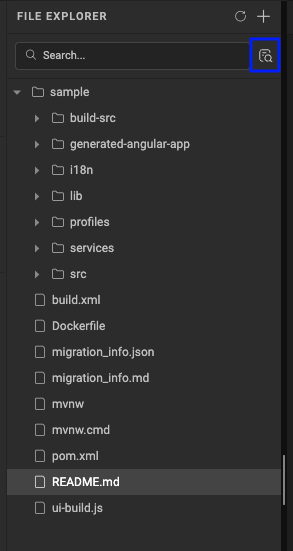
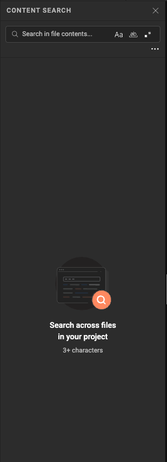
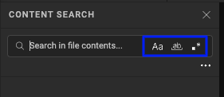
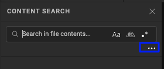
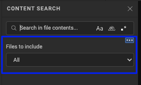
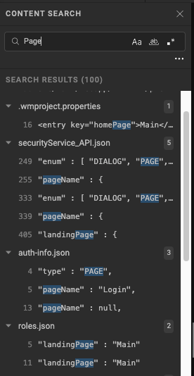
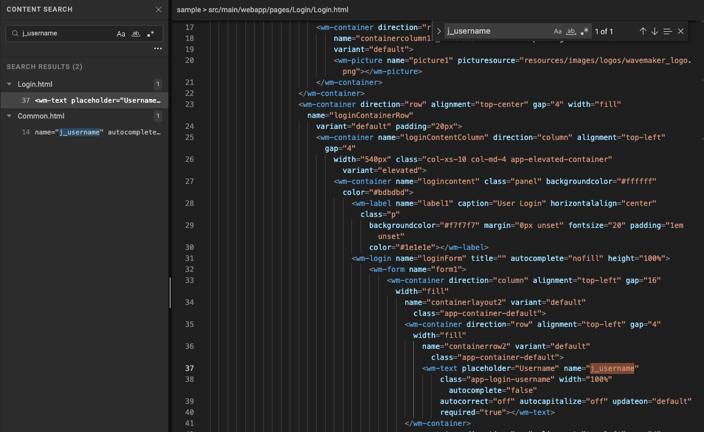
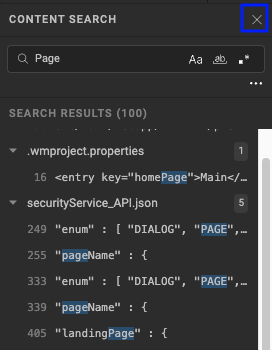

Content Search lets you search across the contents of every file in a project from the Studio file explorer. Use it to find code, variables, services, configuration values, and other text without opening files individually.

---

## Open Content Search

To open Content Search:

1. In the Studio file explorer, click the **Advanced Search** icon next to the filename search box.

2. The file explorer switches to **Content Search** mode.

3. Enter the text to search for.

Content Search can also be opened with a keyboard shortcut:

- **Windows/Linux:** `Ctrl + Shift + F`
- **macOS:** `⌘ + Shift + F`

:::note
Content Search starts matching only after the search term contains at least 3 characters.
:::

---

## Search options

Content Search provides the following options to refine a search:

| Option               | Description                                                                 |
| -------------------- | --------------------------------------------------------------------------- |
| **Case Sensitive**   | Matches the exact capitalization of the search term.                        |
| **Whole Word**       | Matches only complete words, not substrings.                                |
| **Regex**            | Treats the search term as a regular expression instead of a literal string. |
| **Files to include** | Limits the search to a specific project scope.                              |

### Search scope

Click the **More options** (⋯) icon in the Content Search panel to reveal **Files to include**.

The **Files to include** dropdown limits a search to specific types of files in the project. **All** is selected by default.

| Scope              | Searches                           |
| ------------------ | ---------------------------------- |
| **All**            | All supported files in the project |
| **Design Tokens**  | Files related to design tokens     |
| **I18n**           | Localization files                 |
| **Pages**          | Page related files                 |
| **Profile**        | Profile related files              |
| **Resources**      | Project resource files             |
| **Services**       | Service related files              |
| **WMX Components** | WMX component files                |

Selecting a specific scope narrows the results when the part of the project that contains the content is already known. For example, to find a string used only in pages, select **Pages** from **Files to include** before searching.

---

## View search results

For every match, Content Search displays:

- **File name** — the file containing the match
- **Line number** — the line where the match occurs
- **Matching line** — a preview of the line containing the search term
- **Highlighted match** — the matching text highlighted within the preview

Results are grouped by file, and each file shows the number of matches found in it.

---

## Navigate and open results

Search results can be reviewed with the keyboard or the mouse:

- Press **Arrow Down** to move to the next result, and **Arrow Up** to move to the previous one. The selected result is highlighted as you navigate.
- Press **Enter** to open the selected result, or click a result directly to open the corresponding file at the matching line.

---

## Use regular expressions

Enable **Regex** to search using a regular expression instead of an exact text string. Regular expressions are useful when searching for a pattern or multiple variations of a value rather than one literal string.

---

## Close Content Search

Click **Close** in the Content Search panel to return to the normal file explorer.

---

## Example: find all references to a string

To find every reference to `j_username` before refactoring it:

1. Open **Content Search**.
2. Enter `j_username`.
3. Review the matching files and line numbers.
4. Use **Arrow Up** and **Arrow Down** to move between results, or select one directly.
5. Click the result, or press **Enter**, to open the file at the matching line.
6. Review or update the reference as required.

---

## When to use Content Search

Content Search is useful when you need to:

- Find where a variable or service is used.
- Identify references to a deprecated API or configuration.
- Find all occurrences of a string before refactoring it.
- Locate code when the content is known but not the filename.
- Verify that a reference has been fully removed from the project.
- Search across HTML, JavaScript, CSS, Java, JSON, XML, and other supported project files.

### Content Search vs. Filename Search

| Search type         | Searches                  | Use when                                                                                 |
| ------------------- | ------------------------- | ---------------------------------------------------------------------------------------- |
| **Filename Search** | File and folder names     | The name of the file or folder is already known                                          |
| **Content Search**  | Contents of project files | You need to find a string, code, variable, or pattern, regardless of which file it is in |

Content Search allows a project to be searched without switching to an external editor or terminal.

---

## Keyboard shortcuts

| Action                 | Windows/Linux      | macOS           |
| ---------------------- | ------------------ | --------------- |
| Open Content Search    | `Ctrl + Shift + F` | `⌘ + Shift + F` |
| Next search result     | `Arrow Down`       | `Arrow Down`    |
| Previous search result | `Arrow Up`         | `Arrow Up`      |
| Open selected result   | `Enter`            | `Enter`         |
