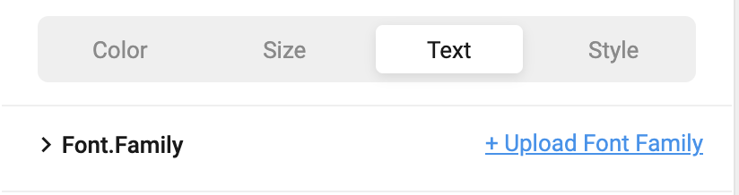
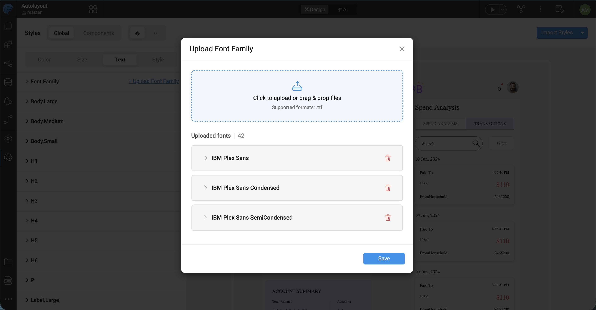

Earlier, using a custom font in a React Native app meant manually copying `.ttf` files into the project and hand-editing `font.config.js`. **Style Workspace** now has an **Upload Font Family** option under the **Text** tab's **Font.Family** token, so you can add custom fonts directly from Studio.

## Uploading a font

1. In the **Text** tab, expand **Font.Family** and click **+ Upload Font Family**.

   

2. In the **Upload Font Family** dialog, drag and drop (or click to browse) the `.ttf` files for a font — for example, all the weights and styles of Roboto downloaded from Google Fonts. Upload the files as downloaded, without renaming them.

3. Studio groups the uploaded files into font families automatically. It first reads the family name from each font file's internal metadata, and falls back to the file name only if metadata isn't available. Files that resolve to the same family (for example `Roboto-Regular.ttf`, `Roboto-Bold.ttf`, `Roboto-Italic.ttf`) are grouped under one entry, such as **Roboto**.

   

   Expand a family to review or adjust the **Fontface-Name** and **Font Style** detected for each file before saving.

4. Click **Save**. The uploaded families are now available wherever a font family is selected.

## Selecting an uploaded font

Once fonts are uploaded, **Font.Family** (and the **brand**, **plain**, and **backup** derived tokens) become a **dropdown** instead of a free-text field. Selecting a family expands its uploaded weights and styles (Regular, Bold, Italic, SemiBold, and so on) so you can pick the exact face to use.

For how `font.family.brand`/`plain`/`backup` tokens are used across the app, see [Introduction to Foundation CSS — Global tokens](./introduction-to-foundation-css#global-tokens).
